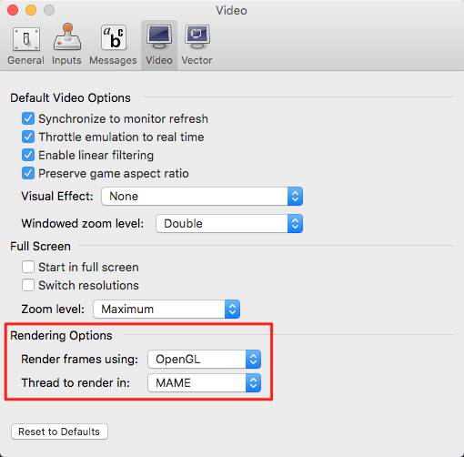
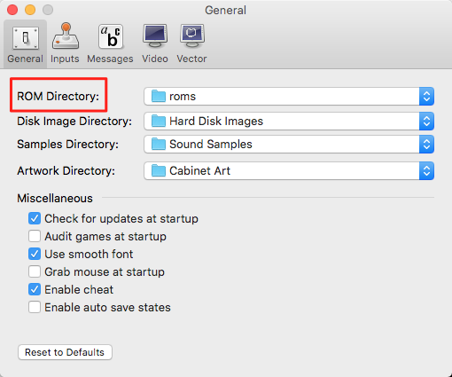
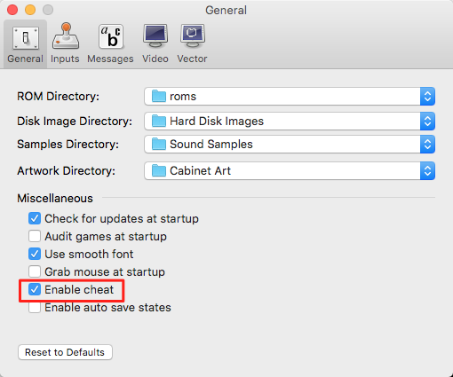
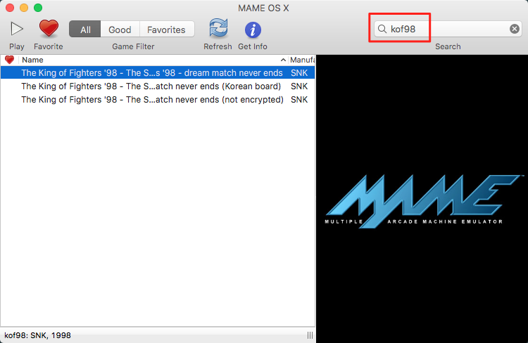
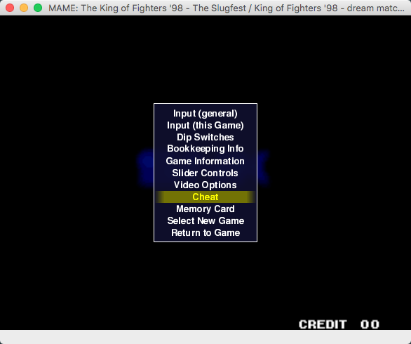
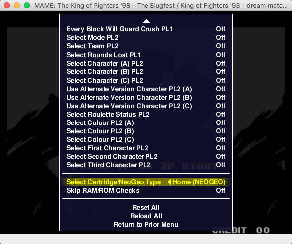
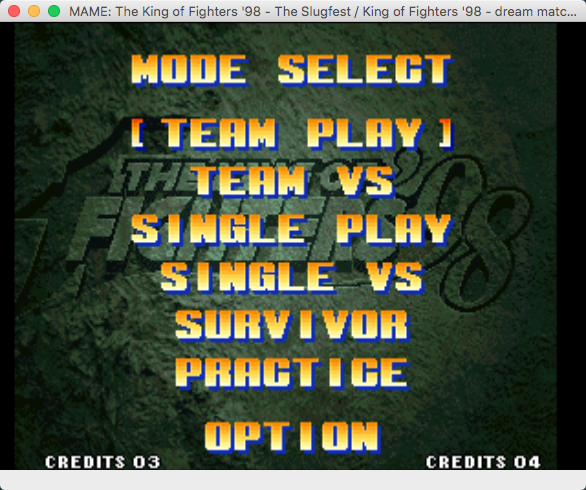

# 如何在 Mac 下玩拳皇
本文提供一种在 MacOS 10.13 下玩拳皇98（有练习模式）的方法。

## 基本步骤

1. 安装模拟器 [MAME OS X]
2. 安装 kof98 的 rom
3. 安装作弊器
4. 玩游戏

## MAME OS X
目前的版本是 0.135，2009年11月5日发布，确实已经很久没更新了，但在 MacOS 10.13 下是完全可用的。
需要注意的是，启动后需要改一下 preferences 的两个选项，否则跑不起来游戏。

## Rom
启动 MAME 后可以设置 Roms 路径：

网上随便找 kof98 的rom，没有平台之分，放到设置好的 Roms 目录下即可。

## Cheat
目前使用的是 0.134 的 [cheat] 文件，下载后：

1. 解压后得到 cheat0134 目录，其中有 cheat.zip 以及两个说明文件，请忽略说明文件，不要按照里面的方法走
2. 将 cheat.zip 重命名为 cheat.dat.zip
3. 将 cheat.dat.zip 放到 $HOME/Library/Application Support/MAME OS X 目录下
4. 在能用设置中勾上 Enable cheat

## 进入练习模式
先启动 kof98:

如果按照上面的步骤添加了 cheat 文件，则按 `TAB` 键出现的菜单中会多出 `cheat` 一项：

回车进入后，倒数第二个菜单项通过左右方向键可设置成家用模式：

这时如果按数字 1 启动 1p 时，出现的菜单中便出现了练习模式：

大功告成！

## Bonus
资料合集链接: https://pan.baidu.com/s/18UpSzghfpEAk3pnYpZ2eGQ 密码: bpa4

[MAME OS X]: http://mameosx.sourceforge.net/
[cheat]: http://cheat.retrogames.com/mame_downloads.htm
